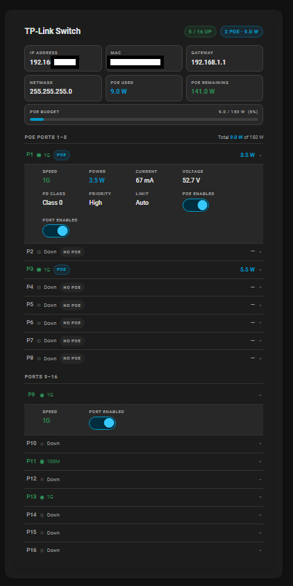
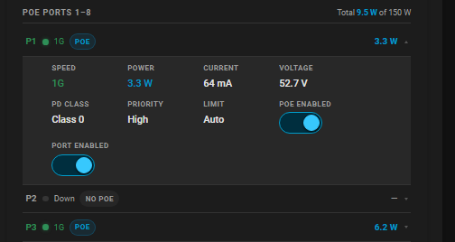
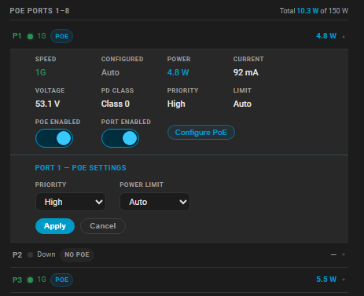
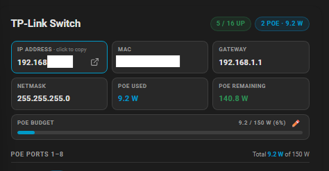
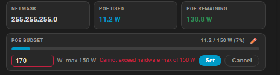
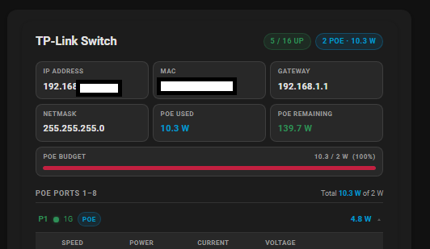

# TP-Link Switch Card

A custom Lovelace card for Home Assistant that gives you a clean, compact overview of your TP-Link Easy Smart switch — port states, PoE consumption, link speeds, per-port controls and PoE configuration, all in one card.

Built for the [TP-Link Easy Smart](https://github.com/vmakeev/hass_tplink_easy_smart) custom integration. No templates, shell commands, or extra helpers required.



---

## Quick start

Install the card, then add this to your dashboard:

```yaml
type: custom:tplink-switch-card
title: TP-Link Switch
entity_prefix: tp_link_switch   # match your integration's entity prefix
poe_ports: 8                    # number of PoE-capable ports (counted from port 1)
total_ports: 16                 # total number of switch ports
max_poe_watts: 150              # optional: hardware PoE cap (blocks budget editor above this)
```

That's it. MAC address, IP and switch URL are all read automatically from the integration — nothing else to configure.

---

## Features

- **Switch overview** — IP address (with link to switch web UI), MAC, gateway, netmask, PoE used/remaining and a live budget bar
- **PoE budget bar** — turns amber above 80% and red above 95% load; click ✏️ to edit the budget limit inline
- **Two port sections** — PoE ports and regular ports displayed separately
- **Per-port status** — link state dot, formatted link speed (1G / 100M / 2.5G), PoE badge and wattage
- **Expandable detail rows** — click a port to reveal voltage, current, PD class, configured speed, priority, power limit and enable toggles
- **PoE configuration panel** — configure PoE priority and power limit per port with Apply/Cancel directly in the card
- **Click to copy** — click the IP address or MAC tile to copy the value to clipboard; works on both HTTP and HTTPS
- **Switch UI shortcut** — link icon next to IP opens the switch web UI in a new tab; derived automatically from the integration, no URL to configure
- **PoE hardware cap** — optional `max_poe_watts` shows the physical limit in the budget editor and blocks Apply if exceeded
- **Theme-aware** — uses HA CSS variables throughout, works with any theme
- **Efficient rendering** — only re-renders when a watched entity actually changes state or attribute

---

## Requirements

- Home Assistant 2025.8 or newer
- [hass_tplink_easy_smart](https://github.com/vmakeev/hass_tplink_easy_smart) custom integration installed and configured

---

## Installation

### Via HACS (recommended)

1. In HACS, go to **Frontend → ⋮ → Custom repositories**
2. Paste `https://github.com/johro897/tplink-switch-card` and choose **Dashboard**
3. Click **Add**, locate **TP-Link Switch Card** and install it
4. Reload Lovelace resources

[](https://my.home-assistant.io/redirect/hacs_repository/?owner=johro897&repository=tplink-switch-card&category=dashboard)

### Manual install

1. Copy `tplink-switch-card.js` to `/config/www/tplink-switch-card/tplink-switch-card.js`
2. Add the resource via **Settings → Dashboards → Resources → +**:
   ```
   /local/tplink-switch-card/tplink-switch-card.js
   ```
3. Hard-refresh your browser (`Ctrl/Cmd + Shift + R`)

---

## How to use the card

The card has three interaction levels:

**1. Port row** — always visible. Shows link state, speed, PoE badge and wattage at a glance.

**2. Detail row** — click any port that has controllable entities to expand. Shows all sensor values (voltage, current, PD class, configured speed) plus PoE enabled and port enabled toggles.



**3. Configure panel** — click **Configure PoE** inside the detail row to open an inline editor for PoE priority and power limit. Hit **Apply** to send the change to the switch, or **Cancel** to close without saving.



> Ports without any controllable entities (no `poe_enabled` or `port_enabled` switch) are not expandable — they show status only.

---

## Configuration

### Card options

| Option | Required | Default | Description |
| --- | --- | --- | --- |
| `title` | No | `TP-Link Switch` | Card header text |
| `entity_prefix` | No | `tp_link_switch` | Prefix used to build all entity IDs — must match the prefix your integration uses |
| `poe_ports` | No | `8` | Number of PoE-capable ports, counted from port 1 |
| `total_ports` | No | `16` | Total number of switch ports |
| `max_poe_watts` | No | — | Hardware PoE maximum in watts (e.g. `150` for TL-SG1016PE). Shows the cap in the budget editor and blocks Apply if exceeded |

### Services used for write operations

The card calls two services from the `tplink_easy_smart` integration. Both identify the switch via `mac_address`, which is read automatically from the `network_info` sensor — no manual configuration needed.

| Service | Description |
| --- | --- |
| `tplink_easy_smart.set_port_poe_settings` | Sets PoE priority and power limit per port |
| `tplink_easy_smart.set_general_poe_limit` | Sets the global PoE budget for the switch |

**Priority values:** `Low`, `Middle`, `High`

**Power limit values:** `Auto`, `Class 1`, `Class 2`, `Class 3`, `Class 4`, `Manual`

---

## Entity naming

The card builds all entity IDs automatically from `entity_prefix`. No manual entity mapping is needed.

### Overview sensors

| Entity | Description |
| --- | --- |
| `sensor.{prefix}_network_info` | IP address (state), MAC, gateway, netmask (attributes) |
| `sensor.{prefix}_poe_consumption` | Total PoE consumption (state, W) with `power_limit_w` and `power_remain_w` attributes |

### Per-port entities

| Entity | Description |
| --- | --- |
| `binary_sensor.{prefix}_port_{n}_state` | Port link state — `on` = connected; attributes include `speed` and `speed_config` |
| `binary_sensor.{prefix}_port_{n}_poe_state` | PoE state — attributes: `power_w`, `current_ma`, `voltage_v`, `pd_class`, `priority`, `power_limit` |
| `switch.{prefix}_port_{n}_poe_enabled` | PoE enable/disable toggle |
| `switch.{prefix}_port_{n}_enabled` | Port enable/disable toggle |

Entities that are missing or unavailable are handled gracefully — the corresponding field is hidden or shows `—`.

---

## Screenshots

### Full card overview

*Switch overview tiles, PoE budget bar, PoE port section and regular port section.*

### Overview tiles — copy and UI link

*Click the IP or MAC tile to copy the value. The link icon opens the switch web UI in a new tab.*

### Expanded port detail

*Expand a port to see all sensor values, configured speed and enable toggles.*

### PoE configure panel

*Configure PoE priority and power limit per port directly in the card.*

### PoE budget editor with hardware cap

*The budget editor shows the hardware cap and blocks Apply if the value exceeds it.*

### PoE budget warning

*Budget bar turns amber above 80% and red above 95% load.*

---

## Troubleshooting

| Problem | Solution |
| --- | --- |
| Card not found | Verify the resource URL is registered and hard-refresh the browser |
| All ports show "Down" | Check that `entity_prefix` matches the prefix your integration uses — look up one entity in Developer Tools → States to confirm |
| Ports are not expandable | The port has no `switch.*_poe_enabled` or `switch.*_enabled` entity — check the integration has created them; some switch models don't support all features |
| Configure PoE button missing | Only shown on PoE ports (ports 1–`poe_ports`) that have a `poe_state` entity |
| PoE Apply fails | Check that `mac_address` is available on `sensor.{prefix}_network_info` — open the entity in Developer Tools → States and look for the `mac` attribute |
| Copy doesn't work | On HTTP installs `navigator.clipboard` is blocked by the browser; the card falls back to `execCommand` automatically — if that also fails, switch HA to HTTPS |
| Budget editor blocks Apply | The value exceeds `max_poe_watts`; lower the value or remove `max_poe_watts` from the config if you want no cap |
| Budget editor shows stale value | The editor pre-fills from the current `power_limit_w` attribute — if the switch hasn't reported the new value yet, wait a few seconds and reopen |

---

## Tested with

| Device | Firmware |
| --- | --- |
| TL-SG1016PE | 2.0 |

Other TP-Link Easy Smart switches using the same integration should work as long as their entities follow the same naming pattern.

---

## Changelog

### v0.9
- Add click-to-copy on IP and MAC overview tiles (HTTP + HTTPS)
- Add switch web UI link icon next to IP — derived automatically from `network_info`
- Auto-read MAC address from `network_info` sensor for service calls — no `mac_address` config key needed
- Add optional `max_poe_watts` hardware cap for the budget editor
- Validate budget on Set click with inline error message; no re-render on input

### v0.1
- Initial release
- Switch overview: IP, MAC, gateway, netmask, PoE consumption, budget bar
- Two port sections: PoE ports and regular ports
- Expandable detail rows with voltage, current, PD class, speed, toggles
- PoE configure panel: priority and power limit per port with Apply/Cancel
- Global PoE budget editor with ✏️ inline editor
- PoE budget bar color warning (amber >80%, red >95%)
- Speed formatter: `1000MF` → `1G`, `2500M` → `2.5G` etc.
- Dirty-check on `hass` updates — only re-renders when watched entities change
- Port entity cache per render cycle

---

## Development

Single self-contained ES2021 file — no build tooling required.

## License

MIT © 2026
