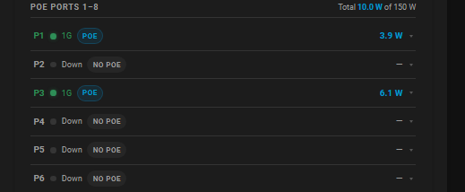

# TP-Link Switch Card

A custom Lovelace card for Home Assistant that gives you a clean, compact overview of your TP-Link Easy Smart switch — port states, PoE consumption, link speeds, and per-port controls, all in one card.

Built for the [TP-Link Easy Smart](https://github.com/vmakeev/hass_tplink_easy_smart) integration. No templates, shell commands, or extra helpers required.


---

## Features

- **Switch overview** — IP address, MAC, gateway, netmask, PoE used/remaining and a live budget bar that turns amber above 80% and red above 95% load
- **Two port sections** — PoE ports and regular ports displayed separately
- **Per-port status** — link state indicator (dot), formatted link speed (1G / 100M / 2.5G), PoE active badge and wattage
- **Expandable detail rows** — click a port to reveal voltage, current, PD class, priority, power limit and inline toggles for PoE enabled / port enabled; only available on ports that actually have controllable entities
- **Theme-aware** — uses HA CSS variables throughout, works with any theme
- **Efficient rendering** — only re-renders when a watched entity actually changes state or attribute

---

## Requirements

- Home Assistant 2025.8 or newer
- [TP-Link Easy Smart](https://github.com/vmakeev/hass_tplink_easy_smart) integration installed and configured

---

## Installation

### 1. Via HACS (recommended)

1. In HACS, go to **Frontend → ⋮ → Custom repositories**
2. Paste `https://github.com/johro897/tplink-switch-card` and choose **Dashboard**
3. Click **Add**, locate **TP-Link Switch Card** and install it
4. Reload Lovelace resources

[](https://my.home-assistant.io/redirect/hacs_repository/?owner=johro897&repository=tplink-switch-card&category=dashboard)

### 2. Manual install

1. Copy `tplink-switch-card.js` to `/config/www/tplink-switch-card/tplink-switch-card.js`
2. Add the resource via **Settings → Dashboards → Resources → +**:
   ```
   /local/tplink-switch-card/tplink-switch-card.js
   ```
3. Hard-refresh your browser (`Ctrl/Cmd + Shift + R`)

---

## Configuration

```yaml
type: custom:tplink-switch-card
title: TP-Link Switch
entity_prefix: tp_link_switch
poe_ports: 8
total_ports: 16
```

### Options

| Option | Required | Default | Description |
| --- | --- | --- | --- |
| `title` | No | `TP-Link Switch` | Card header text |
| `entity_prefix` | No | `tp_link_switch` | Prefix used to build all entity IDs — change this if your integration uses a different name |
| `poe_ports` | No | `8` | Number of PoE-capable ports, counted from port 1 |
| `total_ports` | No | `16` | Total number of switch ports |

---

## Entity naming

The card builds all entity IDs automatically from `entity_prefix`. For the default prefix `tp_link_switch` the expected entities are:

| Entity | Description |
| --- | --- |
| `binary_sensor.{prefix}_port_{n}_state` | Port link state (`on` = connected) |
| `binary_sensor.{prefix}_port_{n}_poe_state` | PoE state with attributes: `power_w`, `current_ma`, `voltage_v`, `pd_class`, `priority`, `power_limit` |
| `switch.{prefix}_port_{n}_poe_enabled` | PoE enable toggle |
| `switch.{prefix}_port_{n}_enabled` | Port enable toggle |
| `sensor.{prefix}_poe_consumption` | Total PoE consumption with attributes: `power_limit_w`, `power_remain_w` |
| `sensor.{prefix}_network_info` | Switch network info with attributes: `mac`, `gateway`, `netmask` |

Entities that are missing or unavailable are handled gracefully — the corresponding field is simply hidden or shows `—`.

---

## Screenshots

### Full card overview

*Switch overview tile with PoE budget bar, PoE port section and regular port section.*

### PoE budget warning

*The PoE budget bar turns amber above 80% and red above 95% load.*

### Expanded port detail

*Click any port with controllable entities to expand inline details — voltage, current, PD class, priority and enable toggles.*

### Port down state

*Disconnected ports show a grey dot and "Down" — no clutter.*

---

## Tested with

| Device | Firmware |
| --- | --- |
| TL-SG1016PE | 2.0 |

Other TP-Link Easy Smart switches using the same HA integration should work as long as their entities follow the same naming pattern.

---

## Development

Single self-contained ES2021 file — no build tooling required.

## License

MIT © 2026
