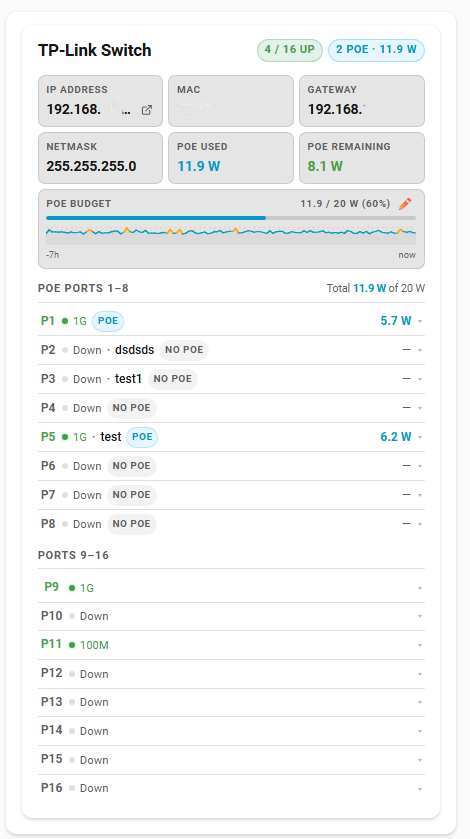
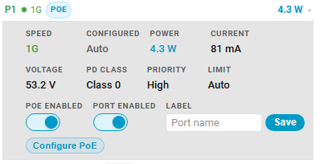
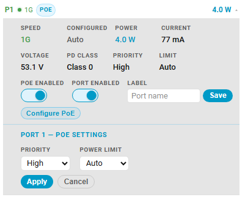
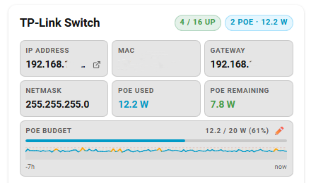
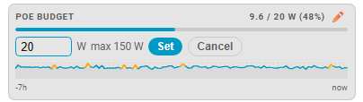
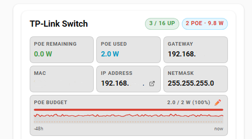

# TP-Link Switch Card

A custom Lovelace card for Home Assistant that gives you a clean, compact overview of your TP-Link Easy Smart switch — including PoE and non-PoE models, configurable overview fields, port states, link speeds and per-port controls.

Built for the [TP-Link Easy Smart](https://github.com/vmakeev/hass_tplink_easy_smart) custom integration. No templates, shell commands, or extra helpers required.



---

## Quick start

Install the card, then add this to your dashboard:

```yaml
type: custom:tplink-switch-card
title: TP-Link Switch
entity_prefix: tp_link_switch   # match your integration's entity prefix
has_poe: true                   # default: true
poe_ports: 8                    # number of PoE-capable ports (counted from port 1)
total_ports: 16                 # total number of switch ports
max_poe_watts: 150              # optional: hardware PoE cap (blocks budget editor above this)
poe_history_hours: 24            # optional: PoE sparkline window in hours, 1-168 (7 days)
overview_layout: tiles            # tiles, compact or hidden
overview_fields:                  # optional: visible fields and their order
  - ip
  - mac
  - gateway
  - netmask
  - poe_used
  - poe_remaining
  - poe_budget
show_switch_link: true            # show web UI shortcut beside the IP address
font_scale: 1                    # optional: scale all card text, e.g. 1.2 = 20% larger
editable_labels: true            # allow editing port labels directly in the card
port_labels:                     # optional labels; omitted ports stay unlabeled
  1: Router
  3: Office PC
  8: Access Point
```

That's it. MAC address, IP and switch URL are all read automatically from the integration — nothing else to configure.

For a switch without PoE support, disable PoE completely:

```yaml
type: custom:tplink-switch-card
title: TP-Link Switch
entity_prefix: tp_link_switch
has_poe: false
total_ports: 16
```

With `has_poe: false`, the card does not watch PoE entities and hides the PoE summary, consumption tiles, budget editor, badges, power values, toggles and configuration controls.

A compact overview for the TL-SG1024DE can show only the useful network information:

```yaml
type: custom:tplink-switch-card
title: TP-Link Switch Verwaltung
entity_prefix: tp_link_switch
has_poe: false
total_ports: 24
overview_layout: compact
overview_fields:
  - ip
  - gateway
show_switch_link: true
```

Set `overview_layout: hidden` or `overview_fields: []` to remove the overview completely.

---

## Features

- **Visual editor** — configure the card through Home Assistant's UI editor, no YAML required for setup
- **Configurable switch overview** — choose visible fields and their order; use tile, compact or hidden layout
- **PoE budget bar** — always shows the switch's actual current budget, read live from its own sensor; click ✏️ to change it — this sends a real command to the switch, it's not just a display value
- **PoE consumption sparkline** — a small trend line under the budget bar, colored per-segment with the same 80%/95% thresholds as the bar itself, so a brief spike reads differently from sustained load; default 24h window, configurable up to 7 days
- **Adaptive port sections** — PoE and regular ports are separated on PoE switches; non-PoE switches show one port list
- **Optional port labels** — add readable names to selected ports without configuring every port
- **Inline label editing** — rename ports directly in the expanded row; saved to the dashboard config on storage-mode dashboards, localStorage fallback otherwise
- **Adjustable font size** — larger defaults, plus `font_scale` to fine-tune all card text
- **Per-port status** — link state dot, formatted link speed (1G / 100M / 2.5G), PoE badge and wattage
- **Expandable detail rows** — click a port to reveal voltage, current, PD class, configured speed, priority, power limit and enable toggles
- **PoE configuration panel** — configure PoE priority and power limit per port with Apply/Cancel directly in the card
- **Click to copy** — click the IP address or MAC tile to copy the value to clipboard; works on both HTTP and HTTPS
- **Switch UI shortcut** — link icon next to IP opens the switch web UI in a new tab; derived automatically from the integration, no URL to configure
- **PoE hardware cap** — optional `max_poe_watts` stops you from entering a value above your switch's physical limit in the budget editor; it's a safety cap on the *input*, not the value shown in the budget bar
- **Theme-aware** — uses HA CSS variables throughout, works with any theme
- **Efficient rendering** — only re-renders when a watched entity actually changes state or attribute
- **Multi-language UI** — auto-translates to your Home Assistant language: English (default), Swedish, German, French

---

## Requirements

- Home Assistant 2025.8 or newer
- [hass_tplink_easy_smart](https://github.com/vmakeev/hass_tplink_easy_smart) custom integration installed and configured

---

## Installation

### Via HACS (recommended)

1. In HACS, go to **Frontend → ⋮ → Custom repositories**
2. Paste `https://github.com/johro897/tplink-switch-card` and choose **Dashboard**
3. Click **Add**, locate **TP-Link Switch Card** and install it
4. Reload Lovelace resources

[](https://my.home-assistant.io/redirect/hacs_repository/?owner=johro897&repository=tplink-switch-card&category=dashboard)

### Manual install

1. Copy `tplink-switch-card.js` to `/config/www/tplink-switch-card/tplink-switch-card.js`
2. Add the resource via **Settings → Dashboards → Resources → +**:
   ```
   /local/tplink-switch-card/tplink-switch-card.js
   ```
3. Hard-refresh your browser (`Ctrl/Cmd + Shift + R`)

---

## How to use the card

The card has three interaction levels:

**1. Port row** — always visible. Shows link state, speed, PoE badge and wattage at a glance.

**2. Detail row** — click a port to expand. Shows all sensor values (voltage, current, PD class, configured speed), PoE enabled and port enabled toggles, and a **Label** field to rename the port.



**3. Configure panel** — click **Configure PoE** inside the detail row to open an inline editor for PoE priority and power limit. Hit **Apply** to send the change to the switch, or **Cancel** to close without saving.



> With `editable_labels: true` (the default), every port row is expandable. When label editing is disabled, ports without any controllable entities (no `poe_enabled` or `port_enabled` switch) are not expandable — they show status only.

---

## Configuration

Add the card via **Edit Dashboard → Add Card → TP-Link Switch Card** and configure it in the visual editor, or use YAML for full control. The editor covers every option below except `port_labels`, which you set directly in the card instead — see [Editing labels in the card](#editing-labels-in-the-card).

> [!NOTE]
> `entity_prefix` in the editor suggests prefixes actually found on your instance (scanned from `sensor.*_network_info` entities), so a mismatch — the most common setup mistake — is easy to spot. You can still type a custom value if your entities haven't loaded yet.

### Card options

| Option | Required | Default | Description |
| --- | --- | --- | --- |
| `title` | No | `TP-Link Switch` | Card header text |
| `entity_prefix` | No | `tp_link_switch` | Prefix used to build all entity IDs — must match the prefix your integration uses |
| `has_poe` | No | `true` | Set to `false` for switches without PoE. Hides all PoE UI and stops watching PoE entities |
| `poe_ports` | No | `8` | Number of PoE-capable ports, counted from port 1. Ignored when `has_poe` is `false` |
| `total_ports` | No | `16` | Total number of switch ports |
| `max_poe_watts` | No | — | Client-side cap on the budget editor's input field — prevents entering a value above your switch's physical PoE maximum (e.g. `150` for TL-SG1016PE). Does **not** set or override the value shown in the budget bar, which always reflects the switch's own reported budget. Ignored when `has_poe` is `false` |
| `poe_history_hours` | No | `24` | How far back the PoE budget sparkline looks, in hours. Clamped to 1–168 (7 days). Limited in practice by your `recorder` integration's own retention (`purge_keep_days`). Ignored when `has_poe` is `false` |
| `overview_layout` | No | `tiles` | Overview design: `tiles`, `compact`, or `hidden` |
| `overview_fields` | No | all fields | Ordered list of visible overview fields. An empty list hides the overview |
| `show_switch_link` | No | `true` | Show the switch web-interface shortcut beside the IP address |
| `font_scale` | No | `1` | Multiplies every font size in the card. `1.2` = 20 % larger. Clamped to 0.7–2 |
| `editable_labels` | No | `true` | Allow editing port labels directly in the expanded port row. Set to `false` to make labels read-only |
| `port_labels` | No | `{}` | Optional mapping of port numbers to labels. Ports not listed remain unlabeled |

### Port labels

Use a sparse YAML mapping so only the ports that need a name have to be listed:

```yaml
port_labels:
  1: Router
  3: Office PC
  7: NAS
  8: Access Point Wohnzimmer
  24: Uplink
```

Port numbers may be omitted between entries and do not need to be sorted. Empty labels, invalid port numbers and ports above `total_ports` are ignored. Long labels are shortened visually in the row; hovering shows the complete text.

### Editing labels in the card

Click a port row to expand it and use the **Label** field to name the port — press **Enter** or click **Save**. Clearing the field removes the label, and **Escape** cancels editing.

How the label is stored:

- On **storage-mode dashboards** (the default UI-managed dashboards), the card writes the label back into its own `port_labels` config via the Lovelace API, so the change syncs to all devices and browsers.
- On **YAML-mode dashboards**, or if the card cannot be uniquely located in the dashboard config (e.g. two identical cards), it falls back to `localStorage` — the label then only exists in the browser where it was entered, and a warning is logged to the console.

Set `editable_labels: false` to hide the label editor and manage labels via YAML only.

### Overview options

Supported `overview_fields` values are:

- `ip`
- `mac`
- `gateway`
- `netmask`
- `poe_used`
- `poe_remaining`
- `poe_budget`

The list order is also the display order. PoE fields are ignored automatically when `has_poe` is `false`. IP and MAC remain clickable for copying when visible.

Minimal tile overview:

```yaml
overview_layout: tiles
overview_fields:
  - ip
```

Compact network overview:

```yaml
overview_layout: compact
overview_fields:
  - ip
  - gateway
  - netmask
```

Keep the IP address but hide the web-interface shortcut:

```yaml
show_switch_link: false
overview_fields:
  - ip
  - mac
```

Hide the complete overview:

```yaml
overview_layout: hidden
```

### Services used for write operations

The card calls two services from the `tplink_easy_smart` integration. Both identify the switch via `mac_address`, which is read automatically from the `network_info` sensor — no manual configuration needed.

| Service | Description |
| --- | --- |
| `tplink_easy_smart.set_port_poe_settings` | Sets PoE priority and power limit per port |
| `tplink_easy_smart.set_general_poe_limit` | Sets the global PoE budget for the switch |

**Priority values:** `Low`, `Middle`, `High`

**Power limit values:** `Auto`, `Class 1`, `Class 2`, `Class 3`, `Class 4`, `Manual`

> [!IMPORTANT]
> Both are real writes to the switch, not local or card-side settings. In particular, the PoE budget bar's ✏️ editor calls `set_general_poe_limit` directly — the number shown in the bar is always read live from the switch's own `power_limit_w` attribute, never from `max_poe_watts` or anything else in the card's YAML. Lowering the budget below what your connected PoE devices are currently drawing can cut their power.

---

## Entity naming

The card builds all entity IDs automatically from `entity_prefix`. No manual entity mapping is needed.

### Overview sensors

| Entity | Description |
| --- | --- |
| `sensor.{prefix}_network_info` | IP address (state), MAC, gateway, netmask (attributes) |
| `sensor.{prefix}_poe_consumption` | Total PoE consumption (state, W) with `power_limit_w` and `power_remain_w` attributes |

### Per-port entities

| Entity | Description |
| --- | --- |
| `binary_sensor.{prefix}_port_{n}_state` | Port link state — `on` = connected; attributes include `speed` and `speed_config` |
| `binary_sensor.{prefix}_port_{n}_poe_state` | PoE state — attributes: `power_w`, `current_ma`, `voltage_v`, `pd_class`, `priority`, `power_limit` |
| `switch.{prefix}_port_{n}_poe_enabled` | PoE enable/disable toggle |
| `switch.{prefix}_port_{n}_enabled` | Port enable/disable toggle |

Entities that are missing or unavailable are handled gracefully — the corresponding field is hidden or shows `—`. When `has_poe` is `false`, PoE entities are not read or watched at all.

---

## Screenshots

### Full card overview

*Switch overview tiles, PoE budget bar, PoE port section and regular port section.*

### Overview tiles — copy and UI link

*Click the IP or MAC tile to copy the value. The link icon opens the switch web UI in a new tab.*

### Expanded port detail

*Expand a port to see all sensor values, configured speed, enable toggles and the label editor.*

### PoE configure panel

*Configure PoE priority and power limit per port directly in the card.*

### PoE budget editor with hardware cap

*The budget editor shows the hardware cap and blocks Apply if the value exceeds it.*

### PoE budget warning

*Budget bar turns amber above 80% and red above 95% load.*

---

## Troubleshooting

| Problem | Solution |
| --- | --- |
| Card not found | Verify the resource URL is registered and hard-refresh the browser |
| All ports show "Down" | Check that `entity_prefix` matches the prefix your integration uses — look up one entity in Developer Tools → States to confirm |
| Ports are not expandable | Only happens with `editable_labels: false` — the port has no `switch.*_poe_enabled` or `switch.*_enabled` entity; check the integration has created them |
| Label only shows on one device | The card fell back to localStorage — check the console for a warning. Happens on YAML-mode dashboards or when two cards have identical configs. Give the cards different titles, or manage labels via `port_labels` in YAML |
| Text too small or too large | Adjust `font_scale`, e.g. `font_scale: 1.3` |
| Configure PoE button missing | Only shown on PoE ports (ports 1–`poe_ports`) that have a `poe_state` entity |
| PoE Apply fails | Check that `mac_address` is available on `sensor.{prefix}_network_info` — open the entity in Developer Tools → States and look for the `mac` attribute |
| Copy doesn't work | On HTTP installs `navigator.clipboard` is blocked by the browser; the card falls back to `execCommand` automatically — if that also fails, switch HA to HTTPS |
| Budget editor blocks Apply | The value exceeds `max_poe_watts`; lower the value or remove `max_poe_watts` from the config if you want no cap |
| Budget editor shows stale value | The editor pre-fills from the current `power_limit_w` attribute — if the switch hasn't reported the new value yet, wait a few seconds and reopen |

---

## Tested with

| Device | Hardware | Firmware |
| --- | --- | --- |
| TL-SG1016PE | — | 2.0 |
| TL-SG1024DE | 7.0 | 1.0.0 Build 20230616 Rel.34205 |

Other TP-Link Easy Smart switches using the same integration should work as long as their entities follow the same naming pattern.

---

## Changelog

### 1.8.0
**Language support** — [#18](https://github.com/johro897/tplink-switch-card/issues/18)
- All rendered UI text (overview tile labels, port status/PoE badges, detail-row labels, label editor, PoE configure panel, budget-limit editor and its error messages, and the visual editor's field labels) now auto-translates based on your Home Assistant instance's configured language
- Supported languages: **English** (default), **Swedish**, **German**, **French** — falls back to English for any other language
- Service parameter values (`Low`/`Middle`/`High` priority, `Auto`/`Class 1-4`/`Manual` power limit) are unchanged — those are real `tplink_easy_smart` values, not display text

**Testing** — [#19](https://github.com/johro897/tplink-switch-card/issues/19)
- Added a checked-in, dependency-free test suite (`test/tplink-switch-card.test.html`) that loads the real card file and exercises it against fake `hass` objects in a real browser — no build chain, no npm

**PoE consumption sparkline** — [#14](https://github.com/johro897/tplink-switch-card/issues/14)
- The PoE budget bar now shows a small inline-SVG trend line of recent consumption underneath it, colored per-segment with the same 80%/95% thresholds as the bar itself — makes a momentary spike easy to tell apart from sustained load
- Default window is 24 hours, configurable up to 7 days via the new `poe_history_hours` option (also exposed in the visual editor)
- Downsampled to a fixed number of points using the max value per bucket, not an average, so spikes stay visible even on a multi-day view
- Uses Home Assistant's own History API — the same approach as `electricity-pie-card` — so there's no new dependency, only your `recorder` integration's own retention setting limits how far back it can show

### 1.6.0
**Security hardening** — [#11](https://github.com/johro897/tplink-switch-card/issues/11)
- Network-info fields (IP, MAC, gateway, netmask) and the switch web-UI link are now HTML-escaped before being rendered — previously these were the one place in the card that skipped the escaping already used everywhere else (e.g. port labels), so a crafted value in the `network_info` sensor could have broken out of an HTML attribute

**Performance** — [#12](https://github.com/johro897/tplink-switch-card/issues/12)
- The list of entities the card watches for changes is now computed once per config change instead of being rebuilt from scratch (up to ~200 entity IDs on a large switch) on every single Home Assistant state update
- The card's change-detection (`_statesChanged`) already existed before this release — this only removes the redundant rebuild of the list it checks against

**Accessibility & theming** — [#13](https://github.com/johro897/tplink-switch-card/issues/13)
- Status colors (up/PoE-good indicators, budget bar, header PoE pill) now use HA's `--success-color`/`--warning-color`/`--error-color` theme variables instead of fixed hex values
- Expandable port rows are now keyboard-operable — reachable via Tab, expand/collapse with Enter or Space
- PoE/port enable toggles now have an `aria-label` naming the port and action, not just relying on adjacent visual text
- The header PoE pill now reflects load (turns amber past 80%, red past 95%), matching the budget bar's own thresholds — useful when `overview_layout: hidden`

### 1.3.0

**Visual editor** (#5)
- Configure the card through Home Assistant's UI — no YAML needed for initial setup
- Built on `ha-form`; covers every card option except `port_labels`, which is edited live in the card itself
- `entity_prefix` suggests prefixes found on your instance instead of requiring exact manual entry

### 1.2.0

**Larger, scalable fonts** (#8)
- All base font sizes increased ~15 %
- New `font_scale` option (default `1`, clamped 0.7–2) multiplies every font size in the card

**Inline port label editing** (#8)
- New **Label** field in the expanded port row — save with Enter or the Save button, clear to remove
- Labels persist into the card's `port_labels` config via `lovelace.saveConfig` on storage-mode dashboards (syncs everywhere)
- Automatic `localStorage` fallback for YAML-mode dashboards or when the card can't be uniquely identified
- All port rows are now expandable when `editable_labels` is enabled (default); disable with `editable_labels: false`
- Drafts survive re-renders caused by entity updates; Escape cancels editing

### 1.1.0

**Port labels**
- Added sparse `port_labels` mapping for optional per-port names
- Labels are validated, HTML-escaped and truncated cleanly in narrow cards

**Configurable overview**
- Added `overview_layout` with `tiles`, `compact`, and `hidden`
- Added ordered `overview_fields` selection
- Added `show_switch_link` to hide the switch web-interface shortcut

### v1.0.0
Verified version. Now official release

### v0.9.0
**PoE configuration**
- Inline configure panel per PoE port — set priority (Low/Middle/High) and power limit (Auto/Class 1–4/Manual) with Apply/Cancel
- Global PoE budget editor via ✏️ icon in the budget bar
- Optional `max_poe_watts` config key shows hardware cap and blocks Apply if exceeded
- Budget validation on Set click with inline error message — no re-render on input
- All service calls use `mac_address` read automatically from `network_info` sensor

**Overview**
- Click IP or MAC tile to copy value to clipboard; falls back to `execCommand` on HTTP
- Link icon next to IP opens switch web UI in new tab
- PoE budget bar turns amber above 80% and red above 95%

**Port details**
- `speed_config` shown as "Configured" in detail row
- Speed formatter: `1000MF` → `1G`, `2500M` → `2.5G` etc.
- `role="button"` and `aria-expanded` on expandable rows

**Performance**
- Dirty-check on `hass` updates — skips re-render when no watched entity changes
- Per-render entity cache via `_portEntitiesCache`

### v0.1.0
- Initial release
- Switch overview: IP, MAC, gateway, netmask, PoE consumption, budget bar
- Two port sections: PoE ports and regular ports
- Expandable detail rows with voltage, current, PD class, speed, toggles
- Port enable and PoE enable toggles per port

---

## Development

Single self-contained ES2021 file — no build tooling required.

## License

MIT © 2026
